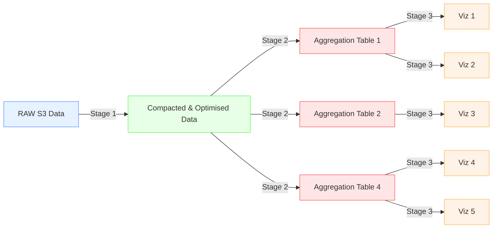

# Boiling Insights

<p align="center">
  
</p>

Boiling Insights is an e2e data processing and visualization application running on laptops and synchronizing data with S3. It uses native DuckDB on laptop by utilizin all CPU cores and working with data directly on fast SSDs. The application also runs on web at https://app.boilingdata.com/, but has limited functionality compared to native application.

"S3 first", "compute once", "laptop first" are some of the principles driving Boiling Insights. It reads raw data from S3, compacts and optimises the data and derives multiple aggregation tables. Visualizations are Apache ECharts configurations and SQL clauses reading data from the aggregation tables. These e2e configurations are called "Data Profiles". They record Data Engineers' and Data Analysts' work over (known) data sources so that you don't have to repeat yourself again and again, but extend.

Every data processing stage is synchronized back to S3, so if the stage already exists on S3, it does not have to be computed again. The more users working over the same data on S3, the more data processing power and faster results.

In other words, Boiling Insights is a distributed Data Warehouse (DDWH) compute with S3 storage. However, since it synchronizes data on laptop, working with the data is blazing fast and iterating the whole e2e data pipeline from raw data to visuazliations happens in seconds. In addition to the full e2e view, this fast feedback cycle and UX/DX makes Boiling Insights stand apart.

- See also example demo videos on your YouTub channel: https://www.youtube.com/watch?v=Dxg09vdpCgw

## INSTALL

Download [Boiling Insights installation file for Mac OSX (arm64)](BoilingInsights-0.8.5-arm64-mac.zip?download=).

**NOTE:** Bare with us, we're adding support for more archs.

## DATA PROFILES

```shell
data-profiles
└── ...
└── ...
└── aws-lambda-json-logs      # Data Profile
    ├── etl-configs           # Stage 1
    ├── database-configs      # Stage 2
    └── chart-templates       # Stage 3
```

Data Profiles are configurations against known raw data sets and include SQL run directly with [DuckDB](https://www.duckdb.org/).



- **Stage 1** (`etl-configs`): Raw data set compaction SQL
- **Stage 2** (`database-configs`): List of aggregation table SQL derived from the compacted data set
- **Stage 3** (`chart-templates`): A set of Apache Echarts configurations with corresponding SQL clauses for ready made charts

### Data Profile: AWS Lambda Logs

Boiling Insights currently supports "AWS Lambda Logs" [`aws-lambda-json-logs`](data-profiles/aws-lambda-json-logs/) Data Profile.

_If you want to add more, create an issue or PR to this repository._

AWS Lambda JSON Logs data profile is special as it requires installing Data Tap for the logs ingestion and AWS Lambda Extension for sending the logs to the URL. In addition, it requires fetching authorization token for the Data Tap and adding it into the Lambda environment variables so that the extension can pick it up and use it when sending the logs to the URL (without authorization the Data Tap rejects the message).

1. Install [Data Taps](https://github.com/boilingdata/data-taps-template) to get ingestion URL, and then
2. Add [Boiling AWS Lambda Extension](https://github.com/dforsber/data-taps-lambda-extension) to your Lambda functions and
3. Configure your Lambda Functions to use JSON logging, and finally
4. Get Boiling Data authorzation token with [`bdcli`](https://github.com/boilingdata/boilingdata-bdcli) and set it into the Lambda Function environment variables (see Data Taps instructions)
5. Optionally, you can disable CloudWatch Logs logging from your Lambda Logs by disabling the `logs:*` rights from the Lambda Functions IAM Role (to save costs)
