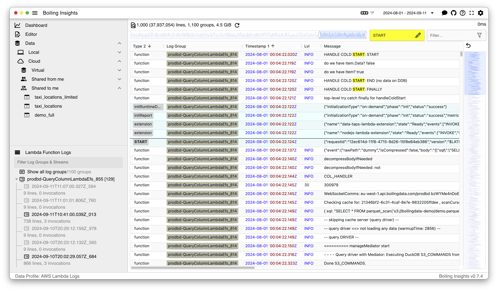
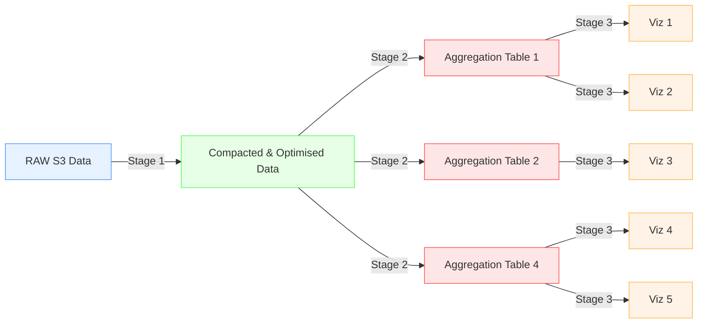

# Boiling Insights

**TL;DR** Download [Boiling Insights.App for Mac OSX (Apple Silicon)](https://github.com/boilingdata/boiling-insights/raw/main/BoilingInsights-v0.8.9-arm64-mac.zip?download=).

<p align="center">
  
</p>

Boiling Insights runs <a href="https://duckdb.org/">DuckDB</a> efficiently on your laptop over your data on S3. You can run any DuckDB extensions you like, query other data sources etc. it is up to you. The <a href="https://duckdb.org/">DuckDB</a> website has all the needed documentation for SQL. It has an optional Boiling Data cloud integration to boost data processing and automation.

Boiling Insights is a local first data stack for building end to end pipelines from ingestion to transformation to visualization. Data is synchronized with S3 and multiple Boiling Insights applications can be running over the same data.

- **Admins** and **Data Engineers** can configure S3 and ETL SQL templates
- **Data Analysts** can create aggregation/derived tables and Charts
- **Business users** can see the charts on dashboards on the web (TBD)

The application runs on web too at https://app.boilingdata.com/, but has limited functionality compared to native application. It supports querying with BoilingData, and will support interactive Dashboards as well.

- Expect at least 10-100x performance improvements over traditional JVM based data processing services like Spark and Presto, and reactive snappy visualisations. Fast SSD, all-in-use CPU cores on your laptop and in-process DuckDB (top tier performing OLAP database engine with vectorised engine and in-memory tables).
- Data is synchronised to your laptop and thus is easy to work with fast and in iterative style, including ETL SQL script and other SQL workbooks, but also Apache ECharts based visualization components. You don't need to run slow and heavy CI/CD pipelines to see if "everything works". In fact, you don't need to build data pipelines on the cloud at all, you can start right away and work with your SQL locally. It's your compute and S3 as the persistence layer. Automation and additional compute can be added by subscribing to BoilingData. The same ETL jobs run automatically on the cloud side.
- All the data from different stages are available as Parquet and DuckDB databases on the application folder, so you can run any other tools over them if you want
- Since the data is local, you can always delete any stage of the data and Boiling Insight will recompute it. This way you can re-process, even back in time, any amount of data you want. The feedback cycle is very fast and only when you're happy with the results, you can sync back to S3

## Road Map

- [x] v0.8 basics
  - [x] Support for AWS Lambda Logs data
  - [x] Support for external Data Profiles folder, editing them
  - [x] Support for adding, editing and selecting Data Sources
  - [x] Boiling cloud integration
  - [x] SQL Workbooks
  - [x] Limited Web version at https://app.boilingdata.com/ (no local data support for now)
- [ ] v0.9 generic data sources
  - [x] Generic Data Source S3 URL template. Data Souarces like CloudTrail logs reside on S3 in non hive-partitioned prefix. Make Boiling Insights support generic non-hive partitioned prefix templates like `s3://buck/prefix/{{year}}/{{month}}/{{day}}` while storing the optimised and compacted data into hive partitioned prefix.
  - [x] Generic raw "logsdata" data browser. Current logs data browser is templated for AWS Lambda Logs (colouring, columns). When supporting more data sources, make this generic.
  - [ ] Support for adding, editing, saving Dashboard configurations and storing them on the disk like other data and configurations for off-the-app editing
  - [ ] SHOWCASE: AWS Cloud Trail logs with over 300k json.gz objects on S3
- [ ] TBD
  - [ ] Add back DuckDB WASM into the Web version, including IndexedDB integration so that web version can show interactive Dashboards based on aggregated tables

## Vision

Distributed local first data stack for building end to end pipelines from ingestion to transformation to visualization with data persisted on S3. Along with rich set of ever growing Data Profiles over known data sources/sets to allow non-data people to run analytics over their data with ease, and allow Data Analysts and Engineers to build on top of existing and avoid repeating themselves again and again (DRY).

## Driving Principles - Data Profiles

"S3 first", "compute once", "local first" are some of the principles driving Boiling Insights. It reads raw data from S3, compacts and optimises the data and derives multiple aggregation tables. Visualizations are Apache ECharts configurations (we could add support for Vega Lite as well, if there is demand) and SQL clauses reading data from the aggregation tables. These **e2e configurations are called "Data Profiles"**. They record Data Engineers' and Data Analysts' work over (known) data sources so that you don't have to repeat yourself again and again, but extend.

Every data processing stage is synchronized back to S3, so if the stage already exists on S3, it does not have to be computed again. The more users working over the same data on S3, the more data processing power and faster results.



In other words, Boiling Insights is like a distributed Data Warehouse (DDWH) compute with S3 storage. However, since it synchronizes data on laptop, working with the data is blazing fast and iterating the whole e2e data pipeline from raw data to visuazliations happens in seconds. In addition to the full e2e view, this fast feedback cycle and UX/DX makes Boiling Insights stand apart.

- See also example demo videos on your YouTub channel: https://www.youtube.com/watch?v=Dxg09vdpCgw

## INSTALL

1. Download zip compressed [Boiling Insights.App file for Mac OSX (arm64)](https://github.com/boilingdata/boiling-insights/raw/main/BoilingInsights-v0.8.9-arm64-mac.zip?download=)
2. Uncompress the zip archive (double-click it)
3. Optionally, copy the resulting app to your Applications folder
4. Start the app (double-click the App)

**NOTE:** Bare with us, we're adding support for more archs.

## DATA PROFILES

```shell
data-profiles
└── ...
└── ...
└── aws-lambda-json-logs      # Data Profile
    ├── etl-configs           # Stage 1
    ├── database-configs      # Stage 2
    └── chart-templates       # Stage 3
```

Data Profiles are configurations against known raw data sets and include SQL run directly with [DuckDB](https://www.duckdb.org/).

- **Stage 1** (`etl-configs`): Raw data set compaction SQL
- **Stage 2** (`database-configs`): List of aggregation table SQL derived from the compacted data set
- **Stage 3** (`chart-templates`): A set of Apache Echarts configurations with corresponding SQL clauses for ready made charts

### Data Profile: AWS Lambda Logs

Boiling Insights currently supports "AWS Lambda Logs" [`aws-lambda-json-logs`](data-profiles/aws-lambda-json-logs/) Data Profile.

- _If you want to add more, create an issue or PR to this repository._

- _If you want to be Data Driven, but don't know how to start, we can help you create Data Profiles over your data with visualisations too. Contact dan.forsberg@boilingdata.com for more information_

AWS Lambda JSON Logs data profile is special as it requires installing Data Tap for the logs ingestion and AWS Lambda Extension for sending the logs to the URL. In addition, it requires fetching authorization token for the Data Tap and adding it into the Lambda environment variables so that the extension can pick it up and use it when sending the logs to the URL (without authorization the Data Tap rejects the message).

1. Install [Data Taps](https://github.com/boilingdata/data-taps-template) to get ingestion URL, and then
2. Add [Boiling AWS Lambda Extension](https://github.com/dforsber/data-taps-lambda-extension) to your Lambda functions and
3. Configure your Lambda Functions to use JSON logging, and finally
4. Get Boiling Data authorzation token with [`bdcli`](https://github.com/boilingdata/boilingdata-bdcli) and set it into the Lambda Function environment variables (see Data Taps instructions)
5. Optionally, you can disable CloudWatch Logs logging from your Lambda Logs by disabling the `logs:*` rights from the Lambda Functions IAM Role (to save costs)
